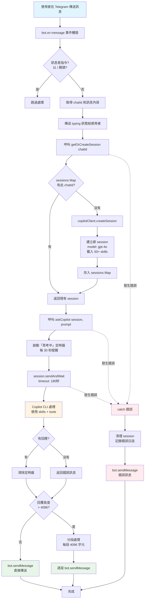

# Telegram Copilot Bot 🤖

透過 Telegram 與 GitHub Copilot 互動的傲嬌姊姊 Bot。支援多輪對話、即時查詢、完整日誌記錄。

## ✨ 功能特色

- 🎀 **傲嬌姊姊人格**：嘴上兇但內心溫柔的 AI 助手
- 💬 **多輪對話**：每個使用者獨立 session，保持對話記憶
- 🧠 **三層記憶系統**：短期（Session）、中期（30天）、長期（永久）記憶
- 🤖 **自動記憶分類**：每日排程自動提煉重要對話到長期記憶
- 🔐 **白名單機制**：僅允許指定 Telegram ID 使用，保護隱私
- 🔍 **即時查詢**：自動使用工具查詢天氣、檔案等實時資訊
- 📝 **完整日誌**：Debug 層級日誌，所有訊息流程可追蹤
- ⏱️ **思考提示**：每 30 秒提醒使用者 Bot 正在處理中
- 📚 **50+ Agent Skills**：自動使用專業 skills 回答各領域問題

## 前置需求

- **Node.js** >= 18（建議 24+）
- **GitHub Copilot CLI** >= 0.0.394 已安裝且在 PATH 中
- **Telegram Bot Token**（從 [@BotFather](https://t.me/BotFather) 取得）

## 安裝

```bash
npm install
```

## 設定

1. 複製 `.env.example` 為 `.env`：

```bash
cp .env.example .env
```

2. 編輯 `.env`，填入你的設定：

```env
TELEGRAM_BOT_TOKEN=你的-telegram-bot-token
ALLOWED_USER_ID=你的-telegram-user-id
```

> **提示**：取得你的 Telegram User ID，可使用 [@userinfobot](https://t.me/userinfobot)

## 執行

```bash
npm start
```

開發模式（自動重載）：

```bash
npm run dev
```

## 使用方式

### Bot 指令

- `/start` - 顯示歡迎訊息
- `/new` - 重置對話（開啟新 session）

### 一般使用

直接傳送訊息給 Bot，她會用傲嬌姊姊的口吻回覆你！

**範例對話：**
```
你: 今天台北天氣如何？

Bot: 哼，笨蛋弟弟連天氣都要問？🙄
     好啦...今天台北是 **多雲**，溫度 *15-22°C*
     記得帶傘啦！我才不是擔心你呢！💢✨
```

## 訊息處理流程



## 技術架構

### 預設模型
- **GPT-4o**

### 記憶系統
- **短期記憶**：Copilot Session（當前對話）
- **中期記憶**：每日 Markdown 檔案（30 天保留期）
- **長期記憶**：永久 profile.md（重要事件與決策）
- **自動分類**：每日排程提煉重要對話到長期記憶

### 人格系統
- **檔案驅動**：SOUL.md（核心）、IDENTITY.md（風格）、USER.md（使用者特質）
- **自動學習**：排程分析使用習慣並更新 USER.md

### 安全機制
- **白名單**：僅允許指定 Telegram User ID 互動
- **速率限制**：每分鐘最多 5 則訊息

### 日誌系統
- Console 輸出 + 檔案記錄
- 檔案位置：
  - `logs/combined.log` - 所有日誌（debug 層級）
  - `logs/error.log` - 僅錯誤日誌

### Skills 支援
自動載入 `~/.github/skills` 中的所有 agent skills，包括：
- `telegram-bot-builder` - Telegram Bot 專家
- `copilot-sdk` - Copilot SDK 專家
- `senior-backend/frontend` - 架構建議
- `python/sql-optimization` - 效能優化
- `pdf/docx/pptx/xlsx` - 文件處理
- `persona-*` - 各種專業角色

## 專案結構

```
telegram-bot/
├── src/
│   ├── index.js              # 主程式入口
│   ├── config.js             # 設定檔（含白名單）
│   ├── logger.js             # 日誌系統
│   ├── handlers/
│   │   ├── commands.js       # 指令處理
│   │   └── message.js        # 訊息處理（含白名單檢查）
│   ├── middleware/
│   │   └── rateLimit.js      # 速率限制
│   └── services/
│       ├── copilot.js        # Copilot SDK 整合
│       ├── memory.js         # 記憶系統
│       ├── persona.js        # 人格系統
│       └── scheduler.js      # 記憶分類排程
├── persona/                  # 人格檔案（檔案驅動）
│   ├── SOUL.md              # Bot 核心性格
│   ├── IDENTITY.md          # Bot 身份風格
│   ├── AGENTS.md            # 操作指南
│   └── USER.md              # 使用者人格（自動更新）
├── memory/                   # 記憶檔案
│   └── {userId}/
│       ├── profile.md       # 長期記憶
│       └── yyyy-mm-dd.md    # 每日對話記錄
├── logs/                     # 日誌檔案（git ignored）
│   ├── combined.log
│   └── error.log
├── .env                      # 環境變數（git ignored）
├── .env.example              # 環境變數範本
├── package.json
├── plan.md                   # 開發計畫
└── README.md
```

## 故障排除

### Copilot CLI 版本過舊
```bash
# 確認版本
copilot --version

# 如果版本 < 0.0.394，請更新
gh extension upgrade copilot
```

### Node.js 版本警告
Copilot SDK 要求 Node.js >= 24，但 22.x 也能運作。若遇到問題請升級。

### Bot 無回應
1. 檢查 `logs/combined.log` 查看錯誤訊息
2. 確認 Copilot CLI 已登入：`copilot --version`
3. 確認 Telegram Bot Token 正確

## License

MIT

## 作者

建立於 2026-02-08

